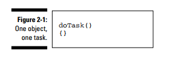
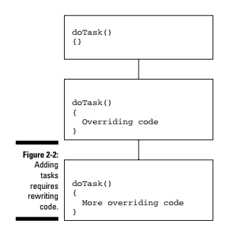
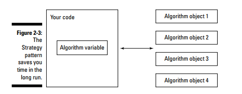

# Strategy Pattern

Here’s the problem, in general. You may find yourself implementing a single
task across several generations of classes. At first, everything is fine, you
handle the task in one class alone, as shown in Figure 2-1.

    

But as time goes on, special cases seem to require new classes, and you
use inheritance and overriding code in the inheriting classes, spreading the
way you handle the single task across a number of inheriting classes (see
Figure 2-2).

    

The Strategy design pattern says that you should extract the volatile parts of
your code and encapsulate them as objects; you can use those objects as you
need them. Now you can customize your code by creating composites of
objects. At runtime, you just use polymorphism to choose the object(s) you
want to work with, as shown in Figure 2-3.

    

**Remember**: The GoF book says the Strategy design pattern should: “Define a family of
algorithms, encapsulate each one, and make them interchangeable. Strategy
lets the algorithm vary independently from clients that use it.

Separate the parts of your code that will change the most from the rest of your application and
try to make them as freestanding as possible for easy maintenance. You
should also always try to reuse those parts as much as possible.

One object, one task often makes sense instead of writing multi-generation
code where one task is spread out over a dozen generations

**TIP**:

- You have volatile code that you can separate out of your application for
easy maintenance.
- You want to avoid muddling how you handle a task by having to split
implementation code over several inherited classes.
- You want to change the algorithm you use for a task at runtime.