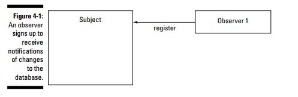
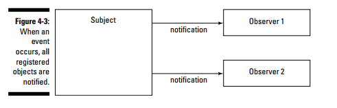

# Observer

The Observer design pattern lets several observer objects be notified when a
subject object is changed in some way. 
Each observer registers with the subject, and when a change occurs, the subject notifies them all. 
Each of the observers is notified in parallel (that is, at the same time)

An observer can register with the subject as shown in Figure 4-1.

When an event occurs, the subject notifies both observers as shown in Figure 4-3.

**TIP**: You should consider the Observer design pattern when, as with event listeners in Java, you have an object that can cause events to occur — events that you want other objects to know about.

## Using Java’s Observer Interface and Observable Class

Java already comes with some built-in support for creating observer-based code.
Java’s support here is based on the Observer interface
and the Observable class.

**Observable** is meant a Subject class. The Java Observable class is what you create subjects with; more specifically, you extend this class to create subjects. This class features some of the built-in methods

*In the examples in the previous section of this chapter, the Observable
object is the Database object, and each observer will be able to interrogate
that object to find out what record was edited, and how*

# Chain of Responsibility

The Chain of Responsibility design pattern also lets you notify objects of a
change, but this time, the objects are connected in a chain — that is, in
series. 
The notification goes from one object to the next until an object is
found that can handle the notification.

The Chain of Responsibility pattern notifies objects in series, along a
chain as illustrated in Figure 4-7:

